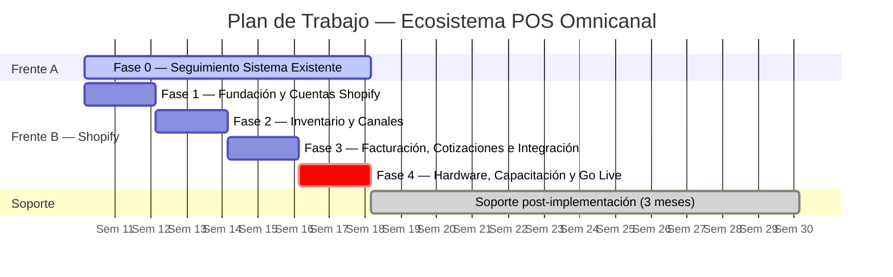

# Integración POS Omnicanal

## Kitchen Valenzuela — Ecosistema POS Omnicanal

**Folio:** D-002
**Fecha:** 10 de marzo de 2026

**Proyecto:** Ecosistema POS Omnicanal
**Cliente:** Kitchen Valenzuela
**Contactos:** Aisha · Rubén Valenzuela
**Proveedor:** Klef Agency

---

## 1. Introducción

Actualmente se requiere integrar un ecosistema de operación omnicanal que unifique su punto de venta físico, su canal de ventas en línea y su proceso de facturación electrónica bajo una sola plataforma. El sistema debe operar con **inventario centralizado** como fuente única de verdad y debe permitir:

- La generación de cotizaciones formales
- Gestionar pedidos mediante panel de administracion
- Emitir **CFDI 4.0** de forma fluida o automática
- Etiquetado de productos
- Hardware de escaneo
- Integración con sistemas externos
- Integracion con canales en linea como pagina web y shopify
- Conexion con Tablet o POS

El proyecto contempla **dos frentes de trabajo en paralelo** durante su primera etapa:

**Frente A — Seguimiento al sistema existente:**
El negocio actualmente cuenta con un desarrollo en curso en [kitchencleanvalenzuela.net](https://kitchencleanvalenzuela.net/). La primera prioridad será dar seguimiento activo y presión al equipo de desarrolladores responsables para que concluyan la entrega del servicio contratado, y validar que la plataforma funcione en todo su alcance antes de proceder con integraciones.

**Frente B — Implementación Shopify (en paralelo):**
Mientras se resuelve la liberación del sistema existente, se avanzará con la configuración de Shopify como plataforma de inventario, POS y ventas en línea. Una vez que el sistema de kitchencleanvalenzuela.net esté liberado y validado, ambas plataformas se conectarán para operar de forma integrada.

Al concluir el proyecto, se brindarán **3 meses de soporte** sobre el ecosistema implementado para garantizar la estabilidad operativa y acompañar al equipo en la adopción del sistema.

---

## 2. Objetivos

1. **Gestión del sistema existente** — Dar seguimiento al equipo de desarrollo de kitchencleanvalenzuela.net hasta obtener la entrega completa y validada.
2. **Inventario centralizado** — Una sola fuente de verdad que refleje el stock disponible en todos los canales en tiempo real.
3. **Sincronización automática** — Cualquier movimiento de inventario se propaga instantáneamente a todos los canales.
4. **Flujo de cotizaciones** — Generar cotizaciones formales que al aceptarse se conviertan en pedidos y descuenten inventario de forma automática.
5. **Facturación CFDI 4.0** — Al confirmarse el pago de cualquier pedido, generar la factura electrónica automáticamente o enviar al cliente el enlace de autofactura.
6. **Etiquetado de productos** — Imprimir etiquetas con código de barras para todos los productos del catálogo.
7. **Hardware integrado** — Operar el POS desde tablet con escáner y etiquetadora.
8. **Integración de sistemas** — Conectar el sistema de kitchencleanvalenzuela.net con Shopify una vez liberado.
9. **Capacitación y adopción** — Que Aisha, Rubén y el equipo operen el sistema con autonomía al finalizar el proyecto.

---

## 3. Alcance del Proyecto

### Incluido

El proyecto se ejecuta en **5 fases** distribuidas en **12 semanas (3 meses)**:

**Fase 0 — Seguimiento Sistema kitchencleanvalenzuela.net** _(Semanas 1–8, continuo)_

- Establecimiento de canal de comunicación directo con el equipo de desarrollo.
- Reporte de brechas: qué está funcionando, qué falta, cuáles son los bloqueos y agilizar el proceso.
- Seguimiento semanal con reportes de avance a definir, compartidas con Aisha y Rubén.
- Pruebas funcionales completas en staging y producción una vez entregado el sistema.
- Documentación de endpoints o métodos disponibles para la integración posterior.

**Fase 1 — Fundación y Cuentas Shopify** _(Semanas 1–2)_

- Creación de cuenta Shopify, selección de plan (Basic) y conexión de dominio.
- Configuración de datos fiscales de Kitchen Valenzuela (RFC, razón social, régimen).
- Conexión de Facturama con Shopify mediante la App oficial.
- Verificación de CSD vigente y configuración de datos de emisión.
- Definición de estructura de impuestos (IVA 16%) y formas de pago.
- Configuración de roles de usuario: Aisha, Rubén y personal de mostrador.

**Fase 2 — Inventario y Canales** _(Semanas 3–4)_

- Diseño de la estructura del catálogo: categorías, variantes, unidades.
- Carga del catálogo de productos con SKU, precio, descripción, stock inicial y fotos.
- Activación de la tienda online de Shopify.
- Configuración de la ubicación de inventario.
- Instalación y configuración de la App Shopify POS en el iPad.
- Pruebas de sincronización: web → POS, POS → web, ajuste manual → ambos canales.

**Fase 3 — Facturación, Cotizaciones e Integración** _(Semanas 5–6)_

- Instalación de App Facturama en Shopify y conexión con credenciales existentes.
- Configuración de Draft Orders con campos fiscales del cliente (RFC, razón social, uso CFDI).
- Prueba completa del ciclo: cotización → aprobación → pedido → pago → CFDI timbrado.
- Integración con kitchencleanvalenzuela.net si ya fue liberado en esta fase.
- Si el portal no está liberado: documentar la integración pendiente y dejar los accesos preparados.

**Fase 4 — Hardware, Capacitación y Go Live** _(Semanas 7–8)_

- Conexión de etiquetadora Dymo e instalación de App Retail Barcode Labels.
- Diseño e impresión de etiquetas para todo el inventario inicial.
- Emparejamiento de escáner Bluetooth con iPad y pruebas en POS.
- Sesión de capacitación con Aisha, Rubén y personal operativo (flujo de venta, cotizaciones, inventario, reportes).
- Definición de procedimientos de apertura y cierre de caja.
- Prueba integral end-to-end: escaneo → cobro → CFDI, sin asistencia técnica.
- **Go Live oficial:** primer día de operación real en todos los canales.

**Soporte post-implementación — 3 meses incluidos** _(Mes 2–4)_

- Resolución de incidencias en Shopify, Facturama y la integración de sistemas.
- Ajustes de configuración que surjan durante la operación real.
- Canal de soporte vía WhatsApp Business con tiempo de respuesta de 24 hrs en días hábiles.
- Reunión mensual de seguimiento (30 min por videollamada).
- Reporte mensual del estado del ecosistema.

### Excluido

- Desarrollo de nuevas funcionalidades no contempladas en este proyecto.
- Rediseño del sitio web o cambios en el tema de Shopify.
- Soporte sobre el sistema de kitchencleanvalenzuela.net si el equipo externo introduce cambios que rompan la integración.
- Suscripción mensual de plataformas (Shopify Basic, etc.) y adquisición de hardware POS.

---

## 4. Servicios

### Fase 0: Seguimiento de Sistema Existente

**Precio:** Incluido en el proyecto
**Descripción:** Gestión activa del proceso de entrega del equipo de desarrollo externo de kitchencleanvalenzuela.net, generación de reportes de avance, establecimiento de criterios de aceptación y validación técnica previa a la integración.

---

### Fase 1: Configuración Base

**Precio:** Incluido
**Descripción:** Creación y configuración de cuenta Shopify con datos fiscales, roles de usuario, conexión a Facturama y configuración de métodos de pago.

---

### Fase 2: Inventario y Canales

**Precio:** Incluido
**Descripción:** Estructura y carga del catálogo de productos, configuración de inventario centralizado, activación de tienda online y POS, pruebas de sincronización omnicanal.

---

### Fase 3: Facturación, Cotizaciones e Integración

**Precio:** Incluido
**Descripción:** Automatización de CFDI 4.0, configuración de Draft Orders como flujo de cotizaciones, y conexión del sistema kitchencleanvalenzuela.net con Shopify (condicionada a liberación del sistema externo).

---

### Fase 4: Hardware, Capacitación y Go Live

**Precio:** Incluido
**Descripción:** Instalación y configuración de hardware POS (escáner, etiquetadora, tablet), capacitación integral del equipo y lanzamiento oficial de operaciones.

---

## 5. Inversión

| Concepto                                       | Detalle                       | Subtotal        |
| ---------------------------------------------- | ----------------------------- | --------------- |
| **Honorarios Klef Agency — Proyecto completo** | Fases 0 a 4 + 3 meses soporte | $24,500 MXN     |
| **TOTAL**                                      |                               | **$24,500 MXN** |

### Plan de Pagos

| #   | Pago              | Monto      | Hito que lo activa                                        |
| --- | ----------------- | ---------- | --------------------------------------------------------- |
| 1   | Arranque          | $6,125 MXN | Firma de propuesta e inicio del proyecto                  |
| 2   | Fase 1 + 2        | $6,125 MXN | Shopify activo, catálogo cargado, canales sincronizados   |
| 3   | Fase 3            | $6,125 MXN | CFDI automático funcionando y cotizaciones operativas     |
| 4   | Go Live + Soporte | $6,125 MXN | Hardware instalado, equipo capacitado y operación en vivo |

> Los 3 meses de soporte post-implementación están **incluidos** en el pago de Go Live. No tienen costo adicional.

---

## Notas

- Precios expresados en pesos mexicanos. El IVA (16%) se desglosará al momento de la facturación según régimen fiscal.
- Vigencia de la cotización: **15 días naturales** a partir de la fecha de emisión.
- **Hardware recomendado (adquisición directa por Kitchen Valenzuela):** estimado entre $758 y $1,498 USD (iPad/tablet, escáner Bluetooth, etiquetadora Dymo, soporte de mostrador y terminal de pagos).
- **Plataformas recurrentes (a cargo de Kitchen Valenzuela):** Shopify Basic ~$25 USD/mes. Facturama, timbres CFDI y dominio ya contratados por el cliente.

## Condiciones de Pago

- Anticipo del 25% para inicio de proyecto (1er pago).
- Pagos subsecuentes vinculados a los hitos descritos en la tabla de pagos y seran pagados contraentrega o en fechas definidas y acordadas con el cliente.
- Pago vía transferencia bancaria o los métodos acordados con el cliente.

## Garantías

- 3 meses de soporte técnico y operativo incluidos tras el Go Live.
- Acompañamiento continuo durante la operación inicial para garantizar estabilidad.

---

## Límites, Alcances y Responsabilidad Compartida

### Responsabilidad compartida en tiempos de entrega

Los tiempos de entrega estimados en este proyecto son condicionales a una **colaboración activa y oportuna por parte de Kitchen Valenzuela**. El calendario de fases asume que:

- La información requerida (datos fiscales, catálogo de productos, credenciales de acceso, CSD, fotos de productos, etc.) será proporcionada **en los tiempos y formatos que Klef Agency indique** al inicio de cada fase.
- Las revisiones y aprobaciones de entregables se realizarán en un plazo máximo de **3 días hábiles** desde que sean compartidos.
- Los accesos necesarios (panel de kitchencleanvalenzuela.net, cuentas de Shopify, Facturama, correo corporativo) serán entregados antes del inicio de la fase correspondiente.

> **Nota importante:** Cualquier retraso originado por demoras en la entrega de información, aprobaciones pendientes o accesos no proporcionados por parte del cliente podrá impactar el calendario de entregas. En ese caso, las fechas se recorrerán proporcionalmente sin que esto represente un incumplimiento por parte del equipo de Klef Agency.

---

### Klef Agency | Laboratorio de Negocios

Los Cabos, B.C.S. | contacto@klef.agency - Visita nuestra pagina https://klef.agency
