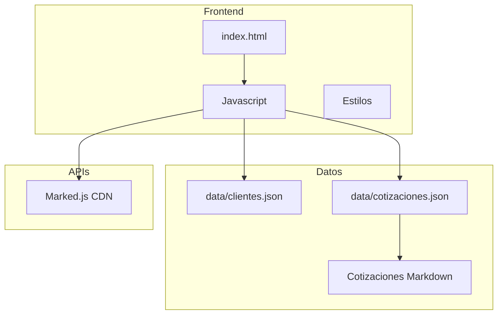
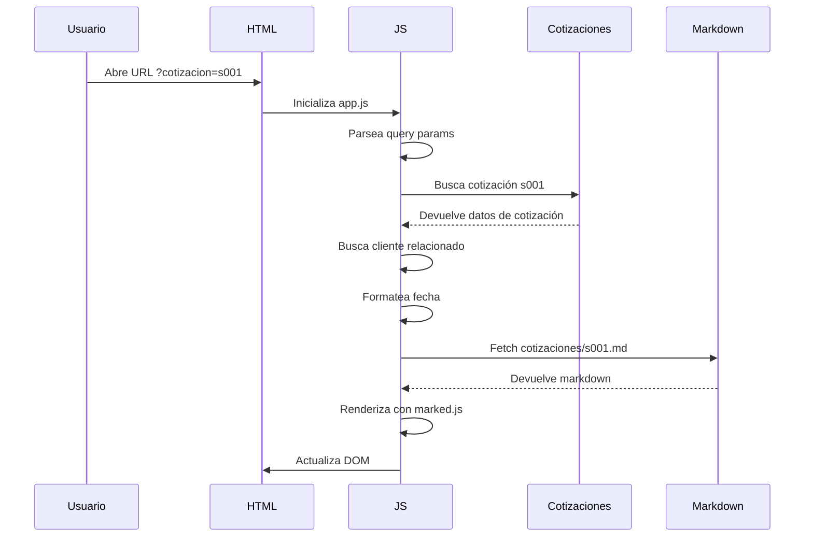
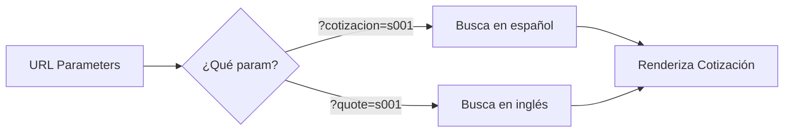
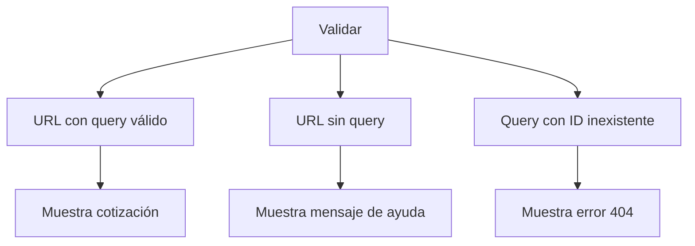

# Plan Detallado: Sistema de Cotizaciones Klef Agency

## 1. Arquitectura General



## 2. Estructura de Archivos

```
q-app/
├── file/
│   └── index.html          # Página principal de cotizaciones
├── data/
│   ├── clientes.json        # Base de datos de clientes
│   └── cotizaciones.json    # Base de datos de cotizaciones
├── js/
│   ├── app.js              # Punto de entrada principal
│   ├── url-parser.js       # Parseo de query params (?cotizacion= o ?quote=)
│   ├── date-formatter.js   # Formateo de fechas en español
│   └── utils.js            # Funciones de utilidad
└── cotizaciones/
    ├── s001.md             # Cotización marketing (s -> marketing)
    ├── d001.md             # Cotización devs (d -> devs)
    ├── m001.md             # Cotización branding (m -> branding)
    └── b001.md             # Cotización studio (b -> studio)
```

## 3. Formato de Datos

### 3.1 clientes.json

```json
{
    "clientes": [
        {
            "id": "1",
            "slug-id": "cumbretezal",
            "nombre": "Cumbre del Tezal",
            "contactos": [
                {
                    "nombre": "Carlos González",
                    "email": "carlos@cumbretezal.com",
                    "telefono": "+52 624 123 4567",
                    "is-main": true
                }
            ]
        },
        {
            "id": "2",
            "nombre": "Grupo Publicitario",
            "slug-id": "grupo-publicitario",
            "contactos": [
                {
                    "nombre": "María López",
                    "email": "maria@grupopublicitario.com",
                    "telefono": "+52 55 9876 5432",
                    "is-main": true
                }
            ]
        }
    ]
}
```

### 3.2 cotizaciones.json

```json
{
    "cotizaciones": [
        {
            "id": "s001",
            "cliente": [{
                "client_slug": "cumbretezal",
                "client_contact": bySlugId(client_slug).isMain
            }],
            "tipo": "studio",
            "folio": "s001",
            "fecha": "2026-02-03",
            "url_md": "/cotizaciones/s001.md",
            "estado": "pendiente"
        },
        {
            "id": "d001",
            "cliente": [{
                "client_slug": "grupo-publicitario",
                "client_contact": bySlugId(client_slug).isMain
            }],
            "tipo": "devs",
            "folio": "d001",
            "fecha": "2026-02-05",
            "url_md": "/cotizaciones/d001.md",
            "estado": "enviada"
        }
    ]
}
```

### 3.3 Mapeo de Categorías

| Letra | Categoría | Descripción |
|-------|-----------|-------------|
| s | studio | Producción audiovisual y studio |
| d | devs | Desarrollo web y aplicaciones |
| m | marketing | Identidad de marca y diseño |
| b | branding | Campañas y estrategias de marketing |

### 3.4 Formato de Fechas

Las fechas se almacenan en formato ISO (YYYY-MM-DD) y se renderizan como:

```
03 de febrero de 2026
```

## 4. Flujo de Funcionamiento



## 5. URLs Soportadas



- `?cotizacion=s001` → Busca cotización con id "s001"
- `?quote=a122` → Busca cotización con id "a122"

## 6. Componentes JavaScript

### 6.1 url-parser.js

```javascript
// Funciones para extraer y normalizar query params
export function getQueryParam() {
    const params = new URLSearchParams(window.location.search);
    return params.get('cotizacion') || params.get('quote');
}
```

### 6.2 date-formatter.js

```javascript
// Funciones para formatear fechas en español
export function formatDate(dateString) {
    const date = new Date(dateString);
    const months = ['enero', 'febrero', 'marzo', ...];
    return `${date.getDate()} de ${months[date.getMonth()]} de ${date.getFullYear()}`;
}
```

### 6.3 app.js

```javascript
// Punto de entrada principal
import { getQueryParam } from './url-parser.js';
import { formatDate } from './date-formatter.js';

async function init() {
    const id = getQueryParam();
    if (id) {
        await loadCotizacion(id);
    }
}

init();
```

## 7. Actualización de index.html

Se agregarán nuevos elementos al DOM:

```html
<!-- Contenido existente del header -->
<div id="cotizacion-content"></div>

<!-- Script de marked.js -->
<script type="module">
    import { marked } from "https://cdn.jsdelivr.net/npm/marked/+esm";
    // Lógica de renderizado
</script>
```

## 8. Ejemplos de Cotizaciones

### 8.1 m001.md (Marketing)

```markdown
# Cotización de Marketing

## Proyecto: Campaña Digital Cumbre del Tezal

### Objetivos
- Aumentar presencia en redes sociales
- Generar leads cualificados
- Mejorar engagement

### Servicios
1. Estrategia de contenido
2. Gestión de redes sociales
3. Publicidad pagada

### Inversión
| Concepto | Costo |
|----------|-------|
| Estrategia | $15,000 MXN |
| Contenido | $25,000 MXN |
| **Total** | **$40,000 MXN** |
```

## 9. Pasos de Implementación

1. **Crear estructura de directorios**
   - `data/`
   - `js/`
   - `cotizaciones/`

2. **Crear archivos JSON**
   - `data/clientes.json`
   - `data/cotizaciones.json`

3. **Crear módulos JavaScript**
   - `js/utils.js`
   - `js/date-formatter.js`
   - `js/url-parser.js`
   - `js/app.js`

4. **Crear contenido de ejemplo**
   - `cotizaciones/s001.md`
   - `cotizaciones/d001.md`
   - `cotizaciones/m001.md`

5. **Actualizar index.html**
   - Agregar contenedor para contenido
   - Importar marked.js
   - Conectar con módulos JS

6. **Probar con diferentes URLs**
   - `?cotizacion=s001`
   - `?quote=d001`
   - Verificar renderizado correcto

## 10. Pruebas de Validación



---


