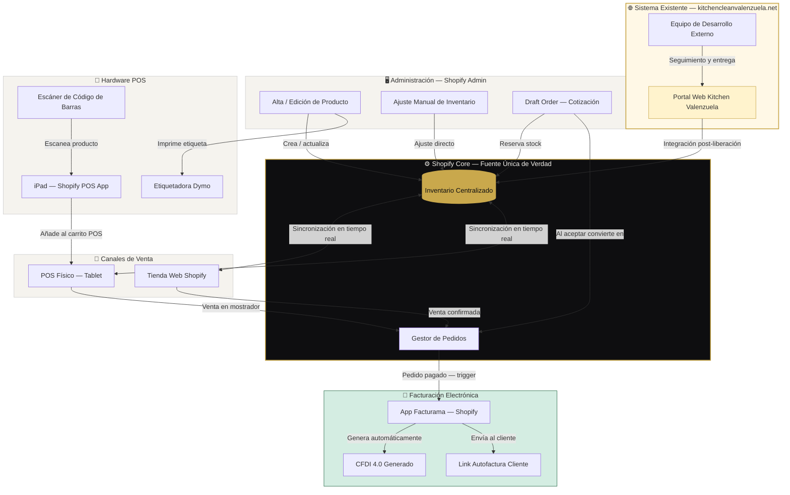

# Propuesta de Proyecto · Ecosistema POS Omnicanal
## Kitchen Valenzuela

**Cliente:** Kitchen Valenzuela
**Contactos:** Aisha · Rubén Valenzuela
**Fecha:** Marzo 2026
**Duración:** 3 meses
**Inversión total:** $24,500 MXN
**Elaborado por:** Klef Agency

---

## Índice

1. [Introducción](#introducción)
2. [Objetivos](#objetivos)
3. [Cómo se desarrollará y mapa de fases](#cómo-se-desarrollará-y-mapa-de-fases)
4. [Diagrama de integración](#diagrama-de-integración)
5. [Desarrollo de las fases](#desarrollo-de-las-fases)
6. [Cuentas y esfuerzos a configurar](#cuentas-y-esfuerzos-a-configurar)
7. [Lista de equipo recomendado](#lista-de-equipo-recomendado)
8. [Plan de pagos](#plan-de-pagos)
9. [Soporte post-implementación](#soporte-post-implementación)
10. [Resumen ejecutivo](#resumen-ejecutivo)

---

## Introducción

Kitchen Valenzuela requiere construir un ecosistema de operación omnicanal que unifique su punto de venta físico, su canal de ventas en línea y su proceso de facturación electrónica bajo una sola plataforma. El sistema debe operar con inventario centralizado como fuente única de verdad, permitir la generación de cotizaciones formales, gestionar pedidos y emitir CFDI 4.0 de forma automática.

El proyecto contempla **dos frentes de trabajo en paralelo** durante su primera etapa:

**Frente A — Seguimiento al sistema existente:**
Kitchen Valenzuela cuenta con un desarrollo en curso en [kitchencleanvalenzuela.net](https://kitchencleanvalenzuela.net/). La primera prioridad será dar seguimiento activo y presión al equipo de desarrolladores responsables para que concluyan la entrega del servicio contratado, y validar que la plataforma funcione en todo su alcance antes de proceder con integraciones.

**Frente B — Implementación Shopify (en paralelo):**
Mientras se resuelve la liberación del sistema existente, se avanzará con la configuración de Shopify como plataforma de inventario, POS y ventas en línea. Una vez que el sistema de kitchencleanvalenzuela.net esté liberado y validado, ambas plataformas se conectarán para operar de forma integrada.

Al concluir el proyecto, se brindarán **3 meses de soporte** sobre el ecosistema implementado para garantizar la estabilidad operativa y acompañar al equipo en la adopción del sistema.

---

## Objetivos

### Objetivo general

Implementar y dejar en operación un ecosistema de punto de venta omnicanal para Kitchen Valenzuela que integre el sistema web existente, una tienda Shopify, inventario centralizado, cotizaciones, y facturación CFDI 4.0 automática.

### Objetivos específicos

1. **Gestión del sistema existente** — Dar seguimiento al equipo de desarrollo de kitchencleanvalenzuela.net hasta obtener la entrega completa y validada del servicio contratado.
2. **Inventario centralizado** — Una sola fuente de verdad que refleje el stock disponible en todos los canales en tiempo real.
3. **Sincronización automática** — Cualquier movimiento de inventario (venta web, venta POS, ajuste manual) se propaga instantáneamente a todos los canales.
4. **Flujo de cotizaciones** — Generar cotizaciones formales que al aceptarse se conviertan en pedidos y descuenten inventario de forma automática.
5. **Facturación CFDI 4.0** — Al confirmarse el pago de cualquier pedido, generar la factura electrónica automáticamente o enviar al cliente el enlace de autofactura.
6. **Etiquetado de productos** — Imprimir etiquetas con código de barras para todos los productos del catálogo.
7. **Hardware integrado** — Operar el POS desde tablet con escáner y etiquetadora.
8. **Integración de sistemas** — Conectar el sistema de kitchencleanvalenzuela.net con Shopify una vez liberado.
9. **Capacitación y adopción** — Que Aisha, Rubén y el equipo operen el sistema con autonomía al finalizar el proyecto.

---

## Cómo se desarrollará y mapa de fases

El proyecto se ejecuta en **5 fases** distribuidas en **12 semanas (3 meses)**. Las primeras dos fases corren en paralelo para optimizar el tiempo y no depender del avance del equipo externo de desarrollo.

```
MES 1                          MES 2                     MES 3
──────────────────────────     ───────────────────────   ──────────────────────
FASE 0          FASE 1         FASE 2       FASE 3       FASE 4      SOPORTE
──────────────────────────     ───────────────────────   ──────────────────────
Seguimiento     Fundación      Inventario   Facturación  Hardware    3 meses de
sistema         y Cuentas      y Canales    y Cotiz.     y Go Live   soporte
existente       Shopify
──────────────────────────     ───────────────────────   ──────────────────────
Sem 1–4         Sem 1–2        Sem 3–4      Sem 5–6      Sem 7–8     Mes 2–4
[PARALELO]      [PARALELO]
```

| Fase | Nombre | Semanas | Entregable |
|------|--------|---------|------------|
| 0 | Seguimiento sistema kitchencleanvalenzuela.net | 1–8 (continuo) | Sistema entregado, validado y funcional |
| 1 | Fundación y Cuentas Shopify | 1–2 | Shopify activo, Facturama configurado |
| 2 | Inventario y Canales | 3–4 | Catálogo cargado, web + POS funcionando |
| 3 | Facturación, Cotizaciones e Integración | 5–6 | CFDI automático, Draft Orders y sistemas conectados |
| 4 | Hardware, Capacitación y Go Live | 7–8 | Operación en vivo con equipo capacitado |
| Soporte | Soporte post-implementación | Mes 2–4 | Acompañamiento continuo 3 meses |

---

## Diagrama de integración



### Leyenda de flujos clave

| Flujo | Descripción |
|-------|-------------|
| Equipo dev → kitchencleanvalenzuela.net | Entrega del sistema contratado bajo seguimiento activo |
| kitchencleanvalenzuela.net → Inventario | Integración post-liberación: el portal conecta con Shopify como backend |
| Admin → Inventario | Alta de producto o ajuste manual se propaga a todos los canales |
| Web / POS → Inventario | Cualquier venta descuenta stock en tiempo real |
| Cotización → Pedido | Draft Order aprobada convierte en pedido y descuenta inventario |
| Pedido Pagado → Facturama | Trigger automático genera CFDI 4.0 o link de autofactura |

---

## Desarrollo de las fases

### Fase 0 — Seguimiento sistema kitchencleanvalenzuela.net *(Semanas 1–8, continuo)*

Esta fase no espera: inicia en la primera semana del proyecto y se mantiene activa en paralelo a todas las demás fases hasta que el sistema externo sea entregado, validado y esté listo para integrarse.

**Acciones principales:**

- Reunión de diagnóstico con Aisha y Rubén para entender el estado actual del desarrollo, los acuerdos firmados con el equipo externo y los pendientes documentados
- Revisión del contrato y alcance pactado con el equipo de kitchencleanvalenzuela.net
- Establecer canal de comunicación directo con el equipo de desarrollo (Slack, WhatsApp, correo o el medio que operen)
- Generar un reporte de brechas: qué está funcionando, qué falta, cuáles son los bloqueos
- Definir un calendario de entregas parciales y criterios de aceptación por funcionalidad
- Dar seguimiento semanal con minutas de avance compartidas con Aisha y Rubén
- Una vez entregado: ejecutar pruebas funcionales completas en staging y producción
- Validar que el sistema opera en el alcance contratado antes de proceder con la integración a Shopify
- Documentar los endpoints o métodos disponibles para la integración posterior

**Criterio de validación:** Sistema funcionando en producción, validado por Kitchen Valenzuela y con documentación técnica suficiente para la integración.

> **Nota:** Si el equipo de desarrollo externo no cumple dentro del plazo del proyecto, se documentará formalmente el estado y se diseñará una ruta alternativa para que la operación de Kitchen Valenzuela no dependa de ese sistema para arrancar.

---

### Fase 1 — Fundación y Cuentas Shopify *(Semanas 1–2)*

Esta fase corre en paralelo a la Fase 0 desde el inicio, para no perder tiempo mientras se resuelve el sistema externo.

**Acciones principales:**

- Crear cuenta Shopify, seleccionar plan (Basic como mínimo) y conectar dominio
- Configurar datos fiscales de Kitchen Valenzuela en Shopify (RFC, razón social, régimen)
- Conectar la cuenta de Facturama existente de Kitchen Valenzuela con Shopify mediante la App oficial
- Verificar que el CSD esté vigente y que los datos de emisión (serie, folio, régimen) estén correctamente configurados en Facturama
- Definir estructura de impuestos (IVA 16%) y formas de pago aceptadas
- Configurar roles de usuario: acceso para Aisha, Rubén y personal de mostrador con los permisos correspondientes

**Criterio de validación:** Shopify activo con datos fiscales y Facturama con CSD listo para timbrar.

---

### Fase 2 — Inventario y Canales *(Semanas 3–4)*

**Acciones principales:**

- Diseñar la estructura del catálogo junto con el equipo de Kitchen Valenzuela: categorías, variantes, unidades
- Cargar el catálogo de productos con SKU, precio, descripción, stock inicial y fotos
- Activar la tienda online de Shopify
- Configurar la ubicación de inventario (una o múltiples según la operación de Kitchen Valenzuela)
- Instalar y configurar la App Shopify POS en el iPad
- Pruebas de sincronización:
  - Venta web → verificar descuento en POS y Admin
  - Venta POS → verificar descuento en tienda web
  - Ajuste manual Admin → verificar en ambos canales

**Criterio de validación:** Las tres pruebas de sincronización confirman resultado correcto en menos de 10 segundos.

---

### Fase 3 — Facturación, Cotizaciones e Integración *(Semanas 5–6)*

**Acciones principales:**

- Instalar App Facturama en Shopify App Store y conectar con las credenciales existentes de Kitchen Valenzuela
- Verificar que la configuración actual de Facturama (serie, folio, régimen, datos del emisor) sea compatible con el flujo de Shopify
- Configurar Draft Orders con campos fiscales del cliente (RFC, razón social, uso CFDI)
- Prueba completa del ciclo: cotización → aprobación → pedido → pago → CFDI timbrado
- **Integración con kitchencleanvalenzuela.net** *(si ya fue liberado en esta fase)*: conectar el portal con Shopify para que las ventas del portal descuenten inventario del mismo sistema
- Si el portal aún no está liberado: documentar la integración pendiente y dejar los accesos preparados para conectarlo en cuanto esté disponible

**Criterio de validación:** Una cotización completa genera un CFDI 4.0 válido timbrado por el SAT.

---

### Fase 4 — Hardware, Capacitación y Go Live *(Semanas 7–8)*

**Acciones principales:**

- Conectar etiquetadora Dymo e instalar App Retail Barcode Labels
- Diseñar e imprimir etiquetas para todo el inventario inicial
- Emparejar escáner Bluetooth con iPad y probar en POS
- Sesión de capacitación con Aisha, Rubén y personal operativo:
  - Flujo de venta en POS y en línea
  - Generación de cotizaciones (Draft Orders)
  - Ajuste de inventario manual
  - Consulta de reportes
  - Reimpresión de etiquetas
- Definir procedimientos de apertura y cierre de caja
- Prueba integral end-to-end: escaneo → cobro → CFDI, sin asistencia técnica
- **Go Live oficial:** primer día de operación real en todos los canales

**Criterio de validación:** El equipo de Kitchen Valenzuela completa una transacción completa (escaneo → cobro → CFDI) de forma autónoma.

---

## Cuentas y esfuerzos a configurar

### Cuentas a crear o configurar

| # | Plataforma / Servicio | Acción requerida | Prioridad |
|---|----------------------|------------------|-----------|
| 1 | **Shopify** | Crear cuenta, plan, dominio | Alta |
| 2 | **Facturama** | ✅ Ya activo — solo conectar con Shopify vía App oficial | Alta |
| 3 | **SAT — CSD** | Verificar vigencia del CSD existente | Media |
| 4 | **Shopify Payments** o terminal externa | Configurar procesador de pagos | Alta |
| 5 | **App Facturama (Shopify App Store)** | Instalar y conectar con credenciales de la cuenta existente | Alta |
| 6 | **App Retail Barcode Labels** | Instalar y configurar plantilla | Media |
| 7 | **Shopify POS App (iPad)** | Instalar y vincular a la tienda | Alta |
| 8 | **kitchencleanvalenzuela.net** | Accesos al panel de administrador para pruebas y validación | Alta |
| 9 | **Correo corporativo Kitchen Valenzuela** | Para envío de cotizaciones y facturas | Media |

### Esfuerzos de configuración técnica

| # | Esfuerzo | Tiempo estimado |
|---|----------|-----------------|
| 1 | Diagnóstico y seguimiento sistema externo | Continuo (Fase 0) |
| 2 | Carga del catálogo de productos | 4–8 horas según volumen |
| 3 | Configuración fiscal en Shopify y Facturama | 1–2 horas |
| 4 | Configuración de canales y ubicaciones | 1 hora |
| 5 | Pruebas de sincronización omnicanal | 2 horas |
| 6 | Configuración flujo CFDI automático | 2–3 horas |
| 7 | Configuración Draft Orders con campos fiscales | 1 hora |
| 8 | Integración kitchencleanvalenzuela.net ↔ Shopify | 4–8 horas (depende de la API disponible) |
| 9 | Diseño de plantilla de etiquetas | 1 hora |
| 10 | Emparejamiento hardware (escáner + etiquetadora) | 1 hora |
| 11 | Capacitación del equipo Kitchen Valenzuela | 3–4 horas |
| 12 | Pruebas integrales end-to-end | 3 horas |

---

## Lista de equipo recomendado

### Hardware

| # | Equipo | Modelo recomendado | Precio estimado (USD) | Notas |
|---|--------|-------------------|----------------------|-------|
| 1 | **Tablet POS** | iPad 9na generación o superior | $329 – $499 | POS App de Shopify optimizada para iOS |
| 2 | **Etiquetadora** | Dymo LabelWriter 450 o 550 | $120 – $200 | Compatible con App nativa de Shopify |
| 3 | **Escáner de código de barras** | Socket Mobile S700 (Bluetooth) | $200 – $250 | Se empareja con iPad vía Bluetooth. Alternativa genérica USB-C a ~$60 USD |
| 4 | **Soporte de mostrador para tablet** | Heckler, Bouncepad o genérico | $60 – $150 | Recomendado para presentación profesional en caja |
| 5 | **Terminal de pagos con tarjeta** | Shopify POS Go o lector Tap & Chip | $49 – $399 | Para cobros con tarjeta sin fricciones |

**Inversión estimada en hardware: $758 – $1,498 USD**

> Kitchen Valenzuela puede adquirir el hardware directamente o a través de Klef Agency. Se recomienda adquirirlo antes de la Fase 4 para tenerlo disponible en la semana de instalación y pruebas.

### Software y suscripciones mensuales *(a cargo de Kitchen Valenzuela)*

| # | Servicio | Costo mensual |
|---|----------|--------------|
| 1 | Shopify Basic | $25 USD/mes |
| 2 | App Facturama | ✅ Ya contratado por Kitchen Valenzuela |
| 3 | Timbres CFDI | ✅ Ya en uso por Kitchen Valenzuela |
| 4 | App Retail Barcode Labels | Gratis |

**Costo mensual adicional estimado de plataformas: ~$25 USD/mes** *(solo Shopify Basic — Facturama ya está contratado)*

---

## Plan de pagos

El proyecto tiene un costo total de **$24,500 MXN**, dividido en 4 pagos vinculados a los hitos de entrega de cada fase. Este esquema protege a Kitchen Valenzuela al ligar cada pago a un resultado concreto, y distribuye la inversión de forma equilibrada a lo largo de los 3 meses.

| # | Pago | Monto | Momento de cobro | Hito que lo activa |
|---|------|-------|------------------|--------------------|
| 1 | **Arranque** | $6,125 MXN | Semana 1 | Firma de propuesta y inicio del proyecto |
| 2 | **Fase 1 + 2** | $6,125 MXN | Semana 4 | Shopify activo, catálogo cargado y canales sincronizados |
| 3 | **Fase 3** | $6,125 MXN | Semana 6 | CFDI automático funcionando y cotizaciones operativas |
| 4 | **Go Live + Soporte** | $6,125 MXN | Semana 8 | Hardware instalado, equipo capacitado y operación en vivo |

> **Total: $24,500 MXN** — 4 pagos iguales de $6,125 MXN cada uno.

Los 3 meses de soporte post-implementación están **incluidos** en el pago de la Fase 4 (Go Live). No tienen costo adicional.

---

## Soporte post-implementación

### Alcance del soporte — 3 meses incluidos

A partir del Go Live (inicio de operaciones en vivo), Klef Agency brindará **3 meses de soporte** sobre el ecosistema implementado. Este soporte cubre:

**Soporte técnico:**
- Resolución de incidencias en Shopify, Facturama y la integración de sistemas
- Ajustes de configuración que surjan durante la operación real
- Revisión de sincronización de inventario si se detectan discrepancias
- Soporte ante actualizaciones de plataforma que afecten el funcionamiento

**Soporte operativo:**
- Dudas del equipo de Kitchen Valenzuela sobre el uso del sistema
- Acompañamiento en la carga de nuevos productos o ajustes de catálogo
- Orientación para resolver situaciones no contempladas en la capacitación inicial

**Comunicación:**
- Canal de soporte vía WhatsApp Business con tiempo de respuesta de 24 horas en días hábiles
- Reunión mensual de seguimiento con Aisha y Rubén (30 min por videollamada)
- Reporte mensual del estado del ecosistema

**Fuera del alcance del soporte incluido:**
- Desarrollo de nuevas funcionalidades no contempladas en este proyecto
- Rediseño del sitio web o cambios en el tema de Shopify
- Soporte sobre el sistema de kitchencleanvalenzuela.net si el equipo externo introduce cambios que rompan la integración

> Cualquier esfuerzo fuera del alcance anterior se cotizará por separado con tarifa preferencial para Kitchen Valenzuela como cliente activo.

---

## Resumen ejecutivo

### El reto de Kitchen Valenzuela

Kitchen Valenzuela enfrenta un punto de inflexión operativo: tiene un sistema web en desarrollo que aún no ha sido entregado por el equipo externo, y la necesidad urgente de estructurar su operación de punto de venta de forma profesional, escalable y fiscalmente correcta. Operar sin un sistema centralizado de inventario expone al negocio a sobreventa, desajustes contables y fricción operativa diaria.

### La estrategia de dos frentes

La solución propuesta opera en paralelo desde el día uno:

**Frente A** — Se da seguimiento activo y presión estructurada al equipo de desarrollo de kitchencleanvalenzuela.net para que entregue el sistema contratado. Se generan reportes de avance, se establecen criterios de aceptación y se valida que la plataforma funcione en todo su alcance antes de integrarla.

**Frente B** — Sin esperar a que el sistema externo se resuelva, se configura Shopify como la columna vertebral del ecosistema: inventario centralizado, tienda online, POS físico, cotizaciones y facturación CFDI 4.0. Cuando el sistema de kitchencleanvalenzuela.net esté listo, se conecta a Shopify y ambos operan como un solo sistema.

### El resultado al mes 3

Al finalizar el proyecto, Kitchen Valenzuela contará con:

- Un ecosistema POS omnicanal completamente operativo
- Inventario centralizado sincronizado entre canal web, POS y sistema existente
- Flujo de cotizaciones → pedidos → CFDI 4.0 automatizado
- Hardware instalado y calibrado en el punto de venta
- Equipo (Aisha, Rubén y personal) capacitado y operando con autonomía
- 3 meses de soporte para garantizar la estabilidad post-implementación

### Inversión

| Concepto | Detalle |
|----------|---------|
| Honorarios del proyecto | $24,500 MXN — 4 pagos de $6,125 MXN |
| Duración | 3 meses (8 semanas de implementación + soporte) |
| Soporte incluido | 3 meses post Go Live |
| Hardware (Kitchen Valenzuela) | $758 – $1,498 USD *(adquisición directa)* |
| Plataformas recurrentes (Kitchen Valenzuela) | ~$25 USD/mes *(Facturama ya contratado)* |

### Próximos pasos para iniciar

1. Firma de la propuesta por parte de Kitchen Valenzuela
2. Primer pago de arranque ($6,125 MXN)
3. Entrega de accesos: panel de kitchencleanvalenzuela.net, datos fiscales (RFC + CSD), correo corporativo
4. Kick-off con Aisha y Rubén — semana 1

---

*Propuesta elaborada por Klef Agency*
*Para: Kitchen Valenzuela · Aisha · Rubén Valenzuela*
*Vigencia de esta propuesta: 15 días naturales*
