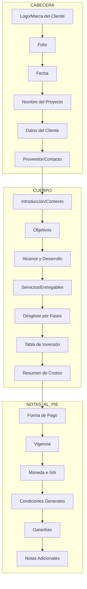

# Modelo Estandarizado de Cotización

## Resumen del Análisis

Se analizaron 6 documentos de prototipo de cotización para identificar patrones comunes y definir una estructura estandarizada. El modelo se organiza en **3 grupos principales**: Cabecera, Cuerpo y Notas al Pie.

---

## Estructura del Documento de Cotización



---

## Grupo 1: Cabecera

Elementos que aparecen en la parte superior del documento, identificando la cotización.

| Elemento | Descripción | Presente en |
|----------|-------------|--------------|
| **Folio** | Identificador único de la cotización (ej: #A123, #A122, #A235) | Todos |
| **Fecha** | Fecha de emisión de la cotización | Todos |
| **Logo/Marca** | Identidad visual del cliente | Todos |
| **Nombre del Proyecto** | Título descriptivo del trabajo | Todos |
| **Proveedor** | Nombre del prestador de servicios | Todos |
| **Datos de Contacto** | Información de comunicación | Algunos |

### Especificación de Campos de Cabecera

```yaml
cabecera:
  folio:
    tipo: string
    formato: "#AXXX"
    ejemplo: "#A123"
  fecha:
    tipo: date
    formato: "d de Month, YYYY"
    ejemplo: "1 de Agosto, 2025"
  cliente:
    nombre: string
    proyecto: string
  proveedor:
    nombre: string
    contacto: string
```

---

## Grupo 2: Cuerpo

Sección principal que contiene toda la información del proyecto.

### 2.1 Introducción y Contexto

- **Descripción General**: Explicación del proyecto y sus objetivos
- **Contexto**: Situación actual y problemática a resolver
- **Propuesta de Valor**: Beneficios esperados

### 2.2 Objetivos

- Objetivos generales y específicos
- Metas medibles
- KPIs esperados

### 2.3 Alcance y Desarrollo

Describe qué está incluido y qué no está incluido en el proyecto.

```
Estructura típica:
├── Alcance Incluido
│   ├── Fase 1: Diseño/Planeación
│   ├── Fase 2: Desarrollo
│   ├── Fase 3: Implementación
│   └── Fase 4: Entrega
└── Alcance Excluido
    ├── Servicios de terceros (ej: hosting, dominio)
    ├── Producción de contenido original
    └── Mantenimiento posterior
```

### 2.4 Listado de Servicios

Cada servicio debe incluir:

```yaml
servicio:
  nombre: string
  descripcion: string
  precio_unitario: number
  cantidad: number
  subtotal: number
  incluye:
    - item1
    - item2
```

### 2.5 Desglose por Fases (Proyectos Complejos)

Para proyectos con múltiples etapas:

```yaml
fase:
  nombre: string
  descripcion: string
  entregables:
    - entregable1
    - entregable2
  duracion: string
  costo: number
```

### 2.6 Tabla de Inversión

Estructura de la tabla de precios:

| Concepto | Descripción | Subtotal |
|----------|-------------|----------|
| Servicio 1 | Descripción | $X,XXX MXN |
| Servicio 2 | Descripción | $X,XXX MXN |
| **Total** | | **$XX,XXX MXN** |

### 2.7 Resumen de Inversión

- Total del proyecto
- Desglose por categoría
- Servicios de terceros (separados)

---

## Grupo 3: Notas al Pie

Información final que complementa y condiciona la cotización.

### 3.1 Forma de Pago

Patrón identificado en todos los documentos:

```
Forma de pago: 50% anticipo / 50% contra entrega
```

Variaciones encontradas:
- Pago único (proyectos pequeños)
- Por fases (proyectos grandes)
- 30 días crédito

### 3.2 Moneda e IVA

```
Precios expresados en pesos mexicanos. No incluyen IVA
IVA 16% opcional (factura): $X,XXX MXN
```

### 3.3 Vigencia

```
Vigencia de la cotización: 20 días naturales
```

### 3.4 Condiciones Generales

- Tiempos de entrega estimados
- Metodología de trabajo
- Requisitos del cliente
- Cambios de alcance

### 3.5 Garantías

- Período de soporte post-entrega
- Corrección de errores
- Training incluido

### 3.6 Notas Adicionales

- Hosting y dominios (terceros)
- Servicios opcionales
- Contacto y canales de comunicación

---

## Plantilla Base de Cotización

```markdown
# CABECERA
## [Logo/Nombre del Cliente]
**Folio:** #[Folio]
**Fecha:** [Fecha]

**Proyecto:** [Nombre del Proyecto]
**Cliente:** [Nombre del Cliente]
**Proveedor:** [Nombre del Proveedor]

---

# CUERPO

## 1. Introducción
[Descripción del proyecto y contexto]

## 2. Objetivos
[Objetivos generales y específicos]

## 3. Alcance del Proyecto
### Incluido:
- [Item 1]
- [Item 2]
### Excluido:
- [Item 1]
- [Item 2]

## 4. Servicios

### Servicio 1: [Nombre]
**Precio:** $X,XXX MXN
**Descripción:**
[Descripción detallada]
**Incluye:**
- [Item 1]
- [Item 2]

### Servicio 2: [Nombre]
[...]

## 5. Inversión

| Concepto | Subtotal |
|----------|----------|
| [Servicio 1] | $X,XXX MXN |
| [Servicio 2] | $X,XXX MXN |
| **Total** | **$XX,XXX MXN** |

---

# NOTAS AL PIE

## Condiciones de Pago
[Forma de pago]

## Notas
- Precios expresados en pesos mexicanos. No incluyen IVA
- Vigencia de la cotización: [X] días naturales
- [Notas adicionales]

## Garantías
[Garantías incluídas]

## Contacto
[Información de contacto]
```

---

## Patrones Identificados por Tipo de Proyecto

### Proyectos de Branding (Pequeños)

| Sección | Complejidad |
|---------|-------------|
| Cabecera | Simple |
| Introducción | Breve |
| Servicios | Lista simple |
| Inversión | Tabla básica |
| Notas | Estándar |

### Proyectos Web (Medianos)

| Sección | Complejidad |
|---------|-------------|
| Cabecera | Simple |
| Introducción | Detallada |
| Servicios | Por fases |
| Inversión | Con desglose |
| Notas | Completas |

### Proyectos Complejos (Web Apps)

| Sección | Complejidad |
|---------|-------------|
| Cabecera | Simple |
| Introducción | Muy detallada |
| Servicios | Múltiples fases |
| Inversión | Con subtotales |
| Notas | Extensas |

---

## Recomendaciones de Implementación

1. **Modularidad**: Crear componentes reutilizables para cada sección
2. **Plantillas**: Mantener plantillas por tipo de proyecto
3. **Validación**: Verificar campos obligatorios antes de generar
4. **Personalización**: Permitir agregar/remover secciones según necesidad
5. **Exportación**: Compatible con PDF y Word

---

## Documentos Analizados

- Cotización - Grupo Publicitario.docx
- Cotizacion - Lome Beauty.docx
- Cotización - Cumbre del Tezal - Proyecto de Imagen.docx
- Cotización - Hana Tao.docx
- Proyecto Web_ Cumbre del Tezal.docx
- Web App - Cabo Explorer - 301225.docx

---

*Documento generado el 4 de Febrero, 2026*
